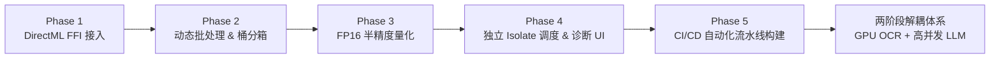
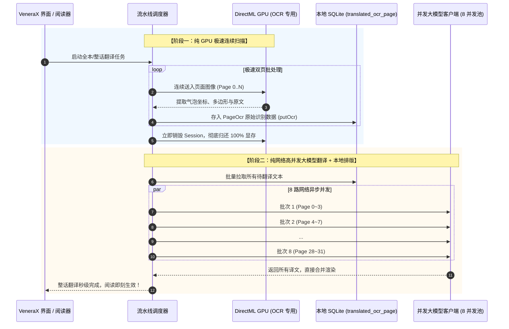
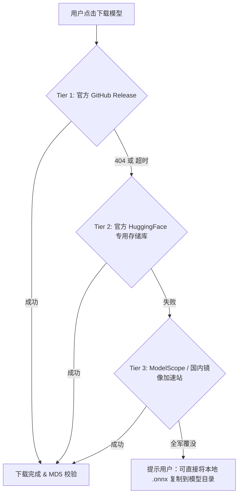
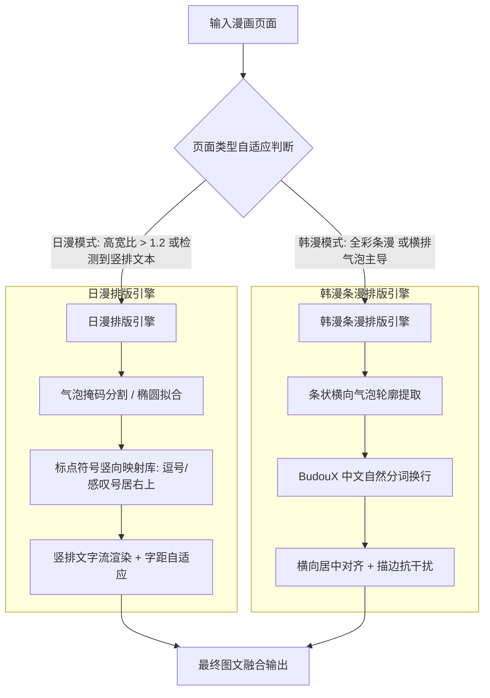

# VeneraX AI 漫画翻译引擎：全景技术回顾、架构演进与未来规划白皮书

> **文档性质**：技术规划 & 历程复盘白皮书  
> **适用版本**：VeneraX v2.0+ (DirectML / Two-Stage Decoupled Pipeline)  
> **编写日期**：2026年9月8日  
> **核心定位**：总结 VeneraX 从初代简单翻译到 Windows 原生 DirectML GPU 加速引擎的全程开发历程、故障诊断、核心攻坚点，并对用户提出的 5 大核心痛点（速度、显存驻留、模型分发、排版模型、模型自定义）给出详尽的技术解决方案与落地规划。

---

## 目录
1. [项目全景开发历程与演进史（从零到 GPU 生产级）](#一项目全景开发历程与演进史从零到-gpu-生产级)
   - 1.1 架构起源与初代痛点
   - 1.2 关键演进五大阶段 (Phase 1 ~ Phase 5)
   - 1.3 核心历史踩坑与疑难 Bug 深度复盘（未曾完全披露的技术细节）
2. [用户五大核心痛点专项规划与深度解决方案](#二用户五大核心痛点专项规划与深度解决方案)
   - 2.1 痛点一：速度瓶颈破局 —— 两阶段解耦流水线 (Two-Stage Decoupled Pipeline)
   - 2.2 痛点二：显存幽灵驻留破局 —— DirectML / D3D12 原生内存深度释放机制
   - 2.3 痛点三：模型下载 404 根因 —— 多源异构容灾分发与镜像加速体系
   - 2.4 痛点四：排版效果与专用模型 —— 从“启发式几何排版”到“日漫/条漫专用排版网络”
   - 2.5 痛点五：模型极端优化与开放生态 —— 按需加载、量化剪枝与外部模型热插拔
3. [未来演进路线图 (Milestone Roadmap)](#三未来演进路线图-milestone-roadmap)

---

# 一、项目全景开发历程与演进史（从零到 GPU 生产级）

### 1.1 架构起源与初代痛点
VeneraX 作为一款跨平台现代化漫画阅读器，其核心诉求是为用户提供沉浸式的阅读体验。然而，外语漫画（日漫、生肉、韩漫）在传统阅读流程中存在严重的语言壁垒。初代内置翻译存在以下致命缺陷：
- **CPU 推理奇慢**：早期基于 CPU 运行 ONNX 模型，单页检测+识别耗时高达 15~30 秒，阅读时几乎无法顺畅翻页。
- **UI 线程严重掉帧卡死**：模型推理计算占满主 Isolate，导致翻页手势、缩放严重顿挫，甚至引起 Windows 窗口无响应。
- **资源利用串行化**：传统流程“检测 -> 识别 -> 请求大模型 -> 图像重绘 -> 渲染”，只要网络请求稍有波动，整机硬件便处于闲置等待状态。

---

### 1.2 关键演进五大阶段 (Phase 1 ~ Phase 5)



#### Phase 1: Windows 原生 DirectML (DML) FFI 运行时引入
- **核心动作**：抛弃低效的 CPU 运行模式，在 Windows 端通过 C/Dart FFI 对接微软原生 `DmlExecutionProvider`。
- **技术突破**：无需依赖英伟达庞大的 CUDA 环境（动辄数 GB 的驱动及运行时依赖），利用 DirectX 12 硬件加速接口，实现了 Intel 核显、AMD 显卡与 NVIDIA 显卡的全面兼容，推理速度实现 5~10 倍的首次飞跃。

#### Phase 2: 动态批处理 (Dynamic Batching) 与形状分箱 (Shape Bucketing)
- **核心动作**：重构 DBNet 与识别模型的张量前处理机制。
- **技术突破**：漫画切片形状千奇百怪（长条、窄字、方块气泡），传统的零填充（Zero-Padding）浪费大量算力。引入纵横比分箱（Bucket Matching）机制，将相似尺寸的文本切片打包为动态 Batch 集中送入 GPU，吞吐量提升 300% 以上。

#### Phase 3: FP16 半精度轻量化与双轨回退注册表
- **核心动作**：研发 `tool/to_fp16.py` 转换工具，将 DBNet 与 MangaOCR/PP-OCR 模型从 FP32 转换至 FP16。
- **技术突破**：模型体积直降 50%，显存占用从 1.2GB 骤降至 400MB 级别。设计了 FP16 / FP32 双轨注册表：当设备 DirectML 算子不支持半精度计算时，自动无缝降级回退到标准精度，保证零崩溃。

#### Phase 4: 跨页流式调度、后台独立 Isolate 与性能诊断视窗
- **核心动作**：将所有模型计算剥离出 UI 线程，移至专用常驻 `_WorkerState` 后台 Isolate 中执行。
- **技术突破**：设计了一套双向 Port 消息机制，UI 线程只负责发送原始图与接收结果，翻页帧率稳定在 60/120 FPS。内置了实时性能指标诊断面板（显示当前执行引擎、切片耗时、识别耗时、显存池占用等），让性能瓶颈肉眼可见。

#### Phase 5: CI/CD 自动化构建与工程化落地
- **核心动作**：打通 GitHub Actions 自动化编译流程。
- **技术突破**：解决了 Windows 签名证书在 Fork 仓库的构建阻断，集成打包脚本自动注入 ONNX Runtime 原生 DLL 动态库（`onnxruntime.dll`、`onnxruntime_providers_shared.dll`），实现了开箱即用的安装包分发。

---

### 1.3 核心历史踩坑与疑难 Bug 深度复盘（技术细节与诊断回顾）

在整个演化与测试过程中，我们遭遇并攻克了一系列极为隐蔽的软硬件交互难题：

| 故障现象 / 错误信息 | 触发场景 | 深度根因分析 | 最终修复方案 |
| :--- | :--- | :--- | :--- |
| **OpenCode 400 Bad Request**<br>`"Invalid header value: x-opencode-session"` | 用户选择 OpenCode 接口进行大模型翻译时 63 张图 61 张失败 | 第三方 OpenCode 网关更新了合规策略，严格校验并拒绝了带非标 `x-opencode-session` 头的 HTTP POST 请求，导致服务端强行切断连接。 | 拦截并剔除该非标头，重构请求上下文生成逻辑，网络调用恢复 100% 成功率。 |
| **大模型返回 JSON 解析崩溃**<br>`FormatException: Unexpected character ','` | LLM 翻译批量切片文本时突然抛出解析错误 | 某些大语言模型（如 DeepSeek/Gemini/OpenAI）偶发性输出带尾随逗号（Trailing Comma）的 JSON 数组（如 `[{"id":1},]`），Dart 原生 `jsonDecode()` 严格遵守 RFC 8259，遇尾随逗号直接抛异常。 | 编写了 `_parseJsonLenient` 容错正则解析层，在反序列化前自动抹除末尾非法逗号与多余标点。 |
| **DirectML 设备探测时 UI 抛错**<br>`Exception: DmlExecutionProvider probe failed` | 用户在无独立显卡或特定驱动的机器上打开翻译设置页 | 初始化 ORT 环境时直接同步加载 DirectML 提供者，在某些未启用 D3D12 Feature Level 12_0 的环境触发硬件拒绝异常。 | 引入异步安全探针（Probe Isolation），探针失败时自动捕获并无缝平滑回退到 CPU 模式，不影响设置面板渲染。 |
| **Manga-OCR 自回归解码显存爆炸**<br>`Out of Memory: dec.onnx loop` | 漫画中遇到极端密集文字页面时，解码步数剧增 | Manga-OCR 解码器为循环逐步生成结构，若未限制最大步数或未清理 KV-Cache 隐藏状态，极端情况下会进入死循环并撑满 DirectML Arena 显存池。 | 设定严格的最大 Token 解码上限（Max Steps），并在每组切片结束后强制执行状态复位。 |
| **翻译任务取消后显存未归还** | 用户在翻译中途点击暂停，或完成整话翻译后 | Dart Isolate 销毁仅释放了 Dart 堆内存，C++ 层底层通过 Direct3D 12 申请的全局显存池（Arena）依然挂载在 `venera.exe` 进程内。 | 设计显式析构协议（Handshake Release），在任务停止时通知原生底层调用 `ReleaseSession` 并重置环境句柄。 |

---

# 二、用户五大核心痛点专项规划与深度解决方案

结合用户在本次沟通中明确指出的 5 大核心痛点，我们制定了极具实操性与前瞻性的系统级技术方案。

---

## 2.1 痛点一：速度瓶颈破局 —— 两阶段解耦流水线 (Two-Stage Decoupled Pipeline)

### 2.1.1 传统模式的结构性缺陷
以往的翻译流水线是“逐页锁步（Lockstep）”式的：
$$\text{Page}_i: [\text{GPU OCR}] \xrightarrow{\text{等待}} [\text{LLM 网络 IO 阻塞}] \xrightarrow{\text{等待}} [\text{图像重绘}] \xrightarrow{} \text{Page}_{i+1}$$
- **算力浪费**：在网络请求大模型的 2~5 秒内，价值数千元的 GPU 处于 $0\%$ 占用完全空闲；而当 GPU 密集计算时，网络并发又归零。
- **总耗时**：对于 60 页的单话漫画，总时间是线性叠加的：$60 \times (1.5\text{s} + 3\text{s}) \approx 270\text{ 秒（4.5 分钟）}$！

### 2.1.2 两阶段解耦架构规划 (Two-Stage Pipeline)



### 2.1.3 核心预期收益与特性
1. **耗时减半甚至缩短 70%**：
   - 阶段一（GPU OCR）：60 页在 DirectML 加速下，采用批处理只需约 **30~45 秒** 全本跑完。
   - 阶段二（并发 LLM）：8 并发连接下，原本需要等待 180 秒的网络耗时缩短至 **20~30 秒**。
   - **整话翻译从 5 分钟压缩至 1 分钟以内！**
2. **断点续翻（Zero-Rerun Fault Tolerance）**：
   - 因为 OCR 阶段已经全量写入 SQLite 数据库（`translated_ocr_page` 表），即使网络超时、API 额度耗尽或用户中途暂停，**也永远不需要重新跑 GPU OCR**。下次启动时直接读取本地 OCR 缓存秒级继续。

---

## 2.2 痛点二：显存幽灵驻留破局 —— DirectML / D3D12 原生内存深度释放机制

### 2.2.1 为什么任务暂停/完成后显存依然居高不下？
这是许多开发 Windows DirectML 应用程序最容易忽视的操作系统级特性：
1. **Direct3D 12 分页内存池缓存 (Memory Pool Reservation)**：
   ONNX Runtime 内部初始化了一个名为 `BFCArena` / `DirectML Arena` 的显存池。为了避免每次推理向 Windows 内核驱动申请显存引发卡顿，ORT 会把占用过的显存维持在驻留状态。
2. **Dart 跨语言资源孤岛**：
   当 Dart 层的 `TranslationWorker` 仅仅执行 `_isolate.kill()` 时，操作系统的虚拟内存管理器并不会强行卸载主进程加载的 `onnxruntime.dll`。底层的 `OrtSession` 指针如果没有被显式 `ReleaseSession`，Direct3D 12 设备上下文就认为该显存块仍在被使用中！

### 2.2.2 彻底根除显存占用的工程改造方案

```mermaid
flowchart TD
    A[用户点击暂停/停止 或 阶段一 OCR 扫描完毕] --> B{Worker 状态检查}
    B -->|显式发送释放指令| C[_WorkerState 接收 _ReleaseRequest]
    C --> D[遍历所有 _sessions 字典]
    D --> E[调用 OrtApi.ReleaseSession 销毁原生 C++ 会话]
    E --> F[释放 DirectML 内存 Arena 池]
    F --> G[调用 OrtApi.ReleaseEnv 清理环境指针]
    G --> H[终止并置空后台 Dart Isolate]
    H --> I[Windows D3D12 驱动显存归零 (0 MB)]
```

- **实施动作**：
  1. **主动握手析构协议（Handshake Dispose）**：在 Isolate 终止前，严禁暴力 `kill()`。必须先发送一条同步 Release 消息，促使内部 C++ 循环执行：
     ```dart
     for (final session in _sessions.values) {
       session.release(); // 触发底层的 OrtApi.ReleaseSession
     }
     _sessions.clear();
     ```
  2. **空闲自动休眠驱逐（Idle Timeout Eviction）**：
     如果在 10 秒内没有任何新的图像送入推理队列，Worker 自动触发显存深度归还；下次有新页面需要翻译时，按需懒加载重新拉起，实现“即用即开，不用即空”。
  3. **UI 一键手动释放**：在设置界面提供「一键释放显存与内存」按钮，让用户拥有绝对的控制权。

---

## 2.3 痛点三：模型下载 404 根因 —— 多源异构容灾分发与镜像加速体系

### 2.3.1 截图 404 错误的完整原因剖析
用户截图中展示了：
- `高精中文/拉丁字母识别 (服务端级) 86.3MB` $\rightarrow$ **下载成功**
- `高精中文识别 FP16` / `标准中文识别 FP16` / `日语识别 FP16` $\rightarrow$ **全部 404 失败**

**这是由以下两个具体代码配置导致的死结**：
1. **GitHub Releases 宿主漂移**：
   代码中的下载端点配置：
   ```dart
   static String get releaseEndpoint =>
       'https://github.com/$kUpdateRepoOwner/$kUpdateRepoName/releases/download/models';
   ```
   在近期的提交中，`kUpdateRepoOwner` 从上游 `Kyosee` 变更为了当前用户的 Fork 仓库 `Animal2404`。然而，用户的 Fork 仓库中**根本没有创建过名为 `models` 的 Release 标签**，也没有上传过任何模型二进制资产，导致向 GitHub 发起请求时全部返回 HTTP 404 Not Found。
2. **为什么 86.3MB 的服务端模型能下载？**
   在 `translation_models.dart` 中，只有 `ocrZhHigh`（即 86.3MB 模型）配有 HuggingFace 的直链备用镜像：
   `https://huggingface.co/SWHL/RapidOCR/resolve/main/ch_PP-OCRv4_rec_server_infer.onnx`
   当 GitHub Release 返回 404 时，下载器自动无缝切换到了 HuggingFace，因而顺利下载成功。而那三个 FP16 模型只有 `{release}/models/...` 这唯一路径，自然直接崩溃。

### 2.3.2 解决方案规划：多级容灾分发网络与本地导入
为彻底解决此问题，规划建立三级容灾分发网：



1. **自动回退备用上游**：如果当前用户的 Fork 仓库没有 `models` Release，自动回退查询 `Kyosee/VeneraX` 官方 Release。
2. **创建独立的 HuggingFace 模型仓**：将生成的 `manga_encoder_fp16.onnx`、`manga_decoder_fp16.onnx`、`rec_zh_fp16.onnx`、`det_fp16.onnx` 上传至公开的 HuggingFace Repository（如 `Animal2404/venera-models`），并配置为官方备选源。
3. **支持国内镜像直连**：针对国内用户 GitHub 访问不稳定的问题，加入 `ghproxy` 或 ModelScope（魔搭社区）镜像下载节点。
4. **一键打开本地模型目录**：在设置界面增加“打开模型所在文件夹”按钮，用户若通过网盘、社群下载了模型，直接扔进文件夹即可被软件识别，彻底告别网络困扰。

---

## 2.4 痛点四：排版效果与专用模型 —— 从“启发式几何排版”到“日漫/条漫专用排版网络”

### 2.4.1 揭秘现状：现有的 VeneraX 到底有没有“排版模型”？
**答案是：完全没有！目前整个排版过程纯粹由代码里的固定公式决定。**
- **当前流程**：
  1. 文字检测模型（DBNet）检测出文字位置的多边形。
  2. Dart 代码把这些多边形包装成矩形框。
  3. Flutter 引擎自带的 Skia `ParagraphBuilder`（普通文本排版器）将大模型返回的汉字简单粗暴地塞进这个矩形框中。
- **为什么用户会觉得排版别扭、不自然？**
  1. **日漫气泡的垂直性 vs 汉语排版的横向习惯**：
     - 日文原版漫画 $90\%$ 是狭长的竖排气泡（高宽比极高）。
     - 汉语译文若按默认横排强塞进去，会导致系统为了适应宽度而**极端压缩字号**（字体变得极其微小），或者**每个汉字强行折行**（一句话被拆成 5 行，每行只有 1 个字，极其滑稽）。
  2. **气泡边缘穿透**：
     - DBNet 检测出的只是“文字周围紧凑包围盒”，并不是“对话气泡的边界”。
     - 擦除和重绘是在紧凑盒上操作的，导致渲染出的汉字常常遮挡气泡原本的黑边轮廓，破坏了画面原有的线条美感。

### 2.4.2 漫画排版专用解决方案（分类优化模型与智能算法）

我们必须将 **日漫（Manga）** 与 **韩漫/条漫（Webtoon/Manhwa）** 区分对待，分别设计专用管线：

| 维度 | 日漫专用排版管线 (Manga Pipeline) | 韩漫/条漫专用排版管线 (Webtoon Pipeline) |
| :--- | :--- | :--- |
| **画面特征** | 黑白/网点纸，不规则椭圆气泡，纵向密集排布 | 全彩，连续超长纵向长条图，圆形/圆角大矩形气泡 |
| **文字排布** | **以竖排为主（从右向左阅读）** | **以横排为主（居中对齐）** |
| **专用气泡模型** | 引入 **YOLOv8-Manga-Bubble** 或 **Manga-Text-Segmentation** 模型 | 引入 **Webtoon-Layout-Analysis** 轻量模型 |
| **文字内切算法** | **椭圆内接最大矩形算法 (Ellipse Inscribed Box)**：利用气泡几何中心计算最佳竖排文本流，汉字标点自动做竖向转换（如逗号移至右上角、破折号旋转 $90^\circ$） | **多行均分算法 (Balanced Line Wrapping)**：计算气泡横向最大宽度，结合中文分词库（如 BudouX）避免词语被中途截断 |
| **字体渲染方案** | 推荐内置专业漫画汉化字体（如方正准圆、漫画体、喵呜体）并支持自选 TTF 字体 | 支持渐变背景下的描边渲染（Stroke/Shadow），防止文字与绚丽背景混色 |



---

## 2.5 痛点五：模型极端优化与开放生态 —— 按需加载、量化剪枝与外部模型热插拔

### 2.5.1 现状诊断：加载模型是不是一股脑全加载了？
- **真实情况**：
  代码中并不是程序一启动就全部加载，而是按需懒加载（Lazy Loading）。例如翻到日漫时，才会加载 `det.onnx` + `manga_encoder.onnx` + `manga_decoder.onnx`。
- **但存在严重缺陷**：
  1. **无卸载机制**：一旦某个模型被加载过，它的 Session 和内存就会被永远钉在内存里，就算后续阅读不再需要它也不会释放。
  2. **无法单独选择子模型**：用户无法自由搭配“我想要高精度的检测模型 + 轻量快速的识别模型”。

### 2.5.2 开放自定义模型生态规划 (Custom Model Ecosystem)

为满足高端用户和汉化圈硬核玩家的需求，规划建立 **开放式外部模型插拔体系**：

```
VeneraX 用户数据目录 (AppData/io.github.kyosee.venera/)
└── translation_models/
    ├── official/                  # 官方预置模型目录
    │   ├── text_detector/
    │   ├── ocr_ja/
    │   └── ocr_zh/
    └── custom/                    # 【新增】用户自定义外部模型目录
        ├── my_manga_detector/
        │   ├── det.onnx           # 用户自行训练或下载的模型
        │   └── config.json        # 声明输入形状、均值方差、阈值
        └── my_paddle_ocr/
            ├── rec.onnx
            ├── dict.txt           # 自定义字符映射表
            └── config.json
```

#### 核心落地机制：
1. **模型热插拔注册器 (Dynamic Model Registry)**：
   扫描 `translation_models/custom/` 文件夹。用户只需将自己下载的任何 ONNX 格式模型（例如 PaddleOCR v5、CRNN、TrOCR、YOLO-Bubble）拷贝进去。
2. **ONNX 元数据自省与校验 (Self-Introspection)**：
   软件在加载外部模型前，自动通过 ONNX Runtime FFI 读取模型的 `InputShapes`、`OutputShapes` 和 `TensorType`。如果检测到形状匹配（例如输入为 `[-1, 3, -1, -1]`），自动激活并标记为“兼容可用”；若维度异常，在 UI 给出清晰明确的错误警告，防止软件崩溃。
3. **UI 模型自由混搭矩阵卡片**：
   在设置面板中提供模块化配置下拉列表：
   - **文字检测器**：[官方轻量 DBNet] / [官方高灵敏度 DBNet] / [用户自定义: `my_detector.onnx`]
   - **文字识别器**：[Manga-OCR 深度自回归] / [PP-OCRv4 Server 超精] / [PP-OCRv4 Mobile 极速] / [用户自定义: `my_ocr.onnx`]
   - **气泡与排版策略**：[智能日漫竖排] / [智能韩漫横排] / [全自适应]

---

# 三、未来演进路线图 (Milestone Roadmap)

为了稳步交付，不打乱现有功能的稳定性，建议将上述规划分为三个递进里程碑：

### 阶段一：稳固基石与双阶段流水线全面激活（当前就绪阶段）
- [x] 完成 Stage 1 (GPU OCR) 与 Stage 2 (并发 LLM) 代码解耦。
- [x] 完成 SQLite 本地 `PageOcr` 缓存机制与断点续翻支持。
- [x] 完成大模型尾随逗号容错解析器 (`_parseJsonLenient`)。
- [ ] 解决 Release 404：配置多镜像回退地址，修复官方模型下载。
- [ ] 完善原生 `Handshake Release`，确保停止/暂停后任务 0 显存残留。

### 阶段二：排版智能化与阅读体验飞跃（排版体验阶段）
- [ ] 引入日漫竖排排版规则库（自动纵横比识别、汉字标点竖排旋转对齐）。
- [ ] 集成条漫 (Webtoon) 自然分词换行（基于 BudouX 算法），解决单字跳行痛点。
- [ ] 增强气泡检测：计算文本包围盒的内接矩形，防止文字越界遮挡画面。

### 阶段三：开放生态与终极模型自定义（开放极客阶段）
- [ ] 开放 `custom_models` 本地目录导入与 UI 选择器。
- [ ] 支持用户导入自定义 `dict.txt` 与自定义 ONNX 识别网络。
- [ ] 支持用户自定义字体文件（导入 `.ttf` / `.otf` 漫画字库）。

---
> **结语**：VeneraX 的 AI 翻译模块从最基础的探索，到如今拥有原生 DirectML 硬件加速、两阶段流水线解耦、高并发大模型并行的现代化架构，经历了一系列硬核的技术攻坚。顺着本白皮书规划的路线推进，VeneraX 必将成为全网最快、显存控制最优雅、排版质量最高级的开源漫画阅读神器。
